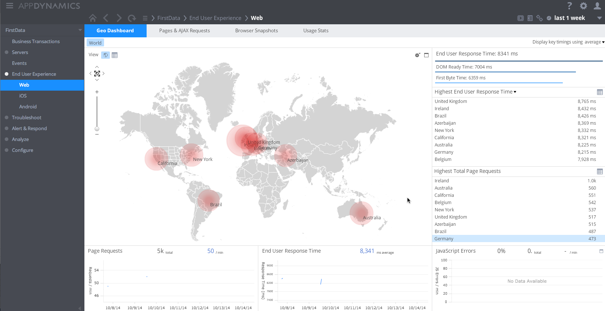
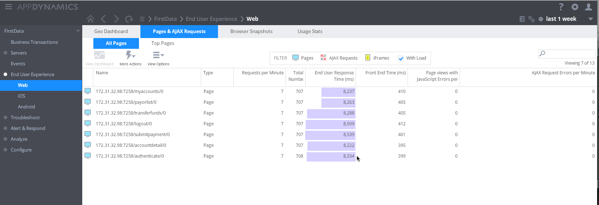

AppdynamicsSyntheticEum
=======================

Synthetically spoof global EUM traffic for a given set of URLs:

## Usage

SyntheticEum.pl --url [<base-url> | <url-list.txt>] --key <eum-app-key>

   + *AppKey* is your EUM Application Key; typically XXX-XXX-XXX
   + [baseURL] enter a single URL to simulate, **OR**
   + [UrlList.dat] pass an input file specificing a list of URLs to hit
   
**Example**

Simulate traffic for http://www.appdynamics.com:

	SyntheticEum.pl --url http://www.appdynamics.com --key ABC-EFG-HIJ
	
Simulate traffic for a list of URLs (Separated by a Newline)
   
	SyntheticEum.pl --url UrlList.dat --key ABC-EFG-HIJ
	
	
	

